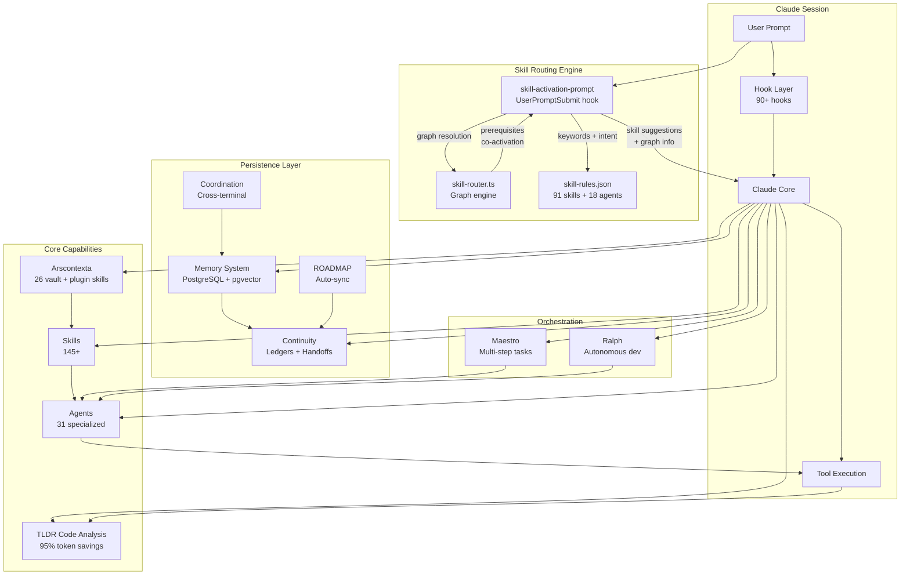

# System Overview

High-level map of all Continuous Claude subsystems and how they connect.

## Subsystem Summary

| Subsystem | Components | Purpose |
|-----------|-----------|---------|
| Hook Layer | 90+ TypeScript hooks | Intercept events, inject context, enforce rules |
| Skill Routing | skill-activation-prompt + skill-router + skill-rules.json | Matches prompts to skills via keywords, intent patterns, and graph traversal |
| Skills | 145+ workflows (incl. 26 arscontexta) | Pre-built task flows triggered by natural language |
| Arscontexta | 10 plugin + 16 vault skills, 9 with graph fields | Knowledge vault management with prerequisite chains and co-activation |
| Agents | 31 specialized (incl. knowledge-guide) | Focused AI assistants for delegation |
| TLDR | 5-layer AST analysis | Structural code understanding at 95% token savings |
| Memory | PostgreSQL + BGE embeddings | Persistent learnings across sessions |
| Continuity | Ledgers + handoffs | State transfer between sessions |
| Coordination | Session + file_claims tables | Multi-terminal conflict prevention |
| ROADMAP | 4 auto-sync hooks | Goal tracking and progress visibility |

## Skill Graph Architecture

The skill routing engine uses a three-layer matching pipeline:

1. **Workflow Triggers** — 7 hardcoded high-confidence regex patterns (fix, build, commit, etc.) that auto-invoke at 90%+ confidence
2. **Keyword + Intent Matching** — Every prompt is matched against `skill-rules.json` entries using keyword lists and regex intent patterns
3. **Graph Resolution** — Matched skills are passed through `skill-router.ts` which resolves prerequisite chains and co-activation peers

Graph fields on skills:
- `prerequisites.require` — Must be loaded before this skill
- `prerequisites.suggest` — Suggested to load first
- `coActivate` — Peer skills to suggest alongside
- `loading` — Eager vs lazy loading mode

9 arscontexta skills have graph fields forming chains like:
`seed -> document -> connect -> verify` (processing pipeline)

Last verified: 2026-03-03
